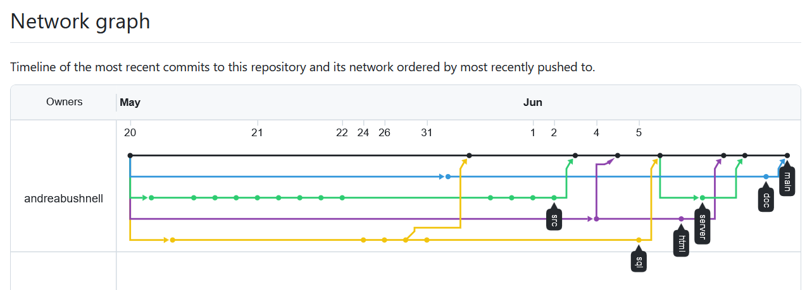
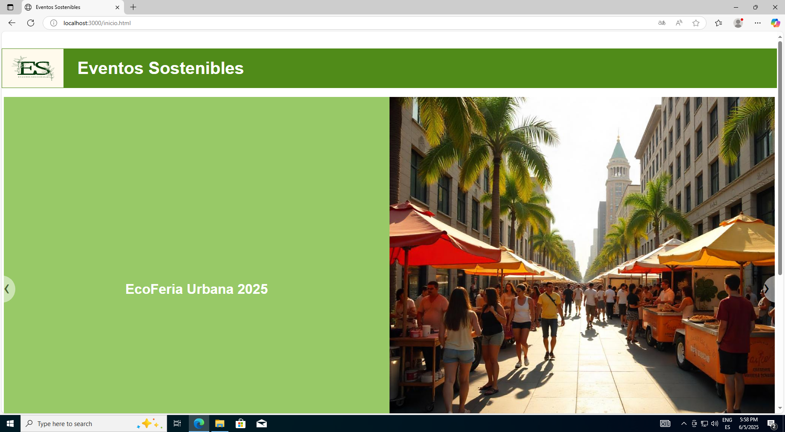

# Proyecto Indra

Este repositorio contiene el desarrollo del Proyecto Dual Indra - DAW1 2025.  

## Índice
1. [Introducción](#introduccion)
2. [Instalación de la máquina virtual y creación del servidor local](#instalacion-de-la-maquina-virtual-y-creacion-del-servidor-local)
3. [Página web](#pagina-web)
4. [Base de datos](#base-de-datos)
5. [Programación](#programacion)  

## Introducción

Este proyecto nace del plan de formación ofrecido por la empresa Indra a estudiantes de primer año de Desarrollo de Aplicaciones Web y Desarrollo de Aplicaciones Multiplataforma. Su objetivo es consolidar lo aprendido en el curso en una tarea final que reúne contenidos de lenguajes de marcas, programación orientada a objetos, bases de datos y sistemas operativos. Además, ofrece a los alumnos la oportunidad de ganar más experiencia en el uso de herramientas como Github y Visual Studio Code.

La temática del proyecto rodea la gestión de eventos relacionados con la sostenibilidad, en la que tenemos dos protagonistas principales: los usuarios que asisten a los eventos, y los organizadores que los gestionan.

La evolución del proyecto se muestra detalladamente en el grafo de ramas de Git. En él se pueden ver los commits de cada rama y sus posteriores merges a /main.

  

## Instalación de la máquina virtual y creación del servidor local

Usando VirtualBox se montó una máquina virtual con Windows 10, atendiendo a los requisitos de este sistema operativo. Sobre esta máquina se creó un servidor local utilizando Node.js, un entorno de ejecución de JavaScript.

  

## Página web

La página se desarrolló utilizando HTML, CSS y JavaScript para crear una interfaz estática que simula un portal de eventos. Se deja abierta la posibilidad de ampliar el proyecto para acomodar la conexión con una base de datos y la implementación del código Java para convertir esta página en una dinámica, que permita el control niveles de acceso (Usuario vs Organizador), así como la modificación y actualización de los datos que muestra.

  

## Base de datos

La base de datos enmarca las relaciones entre los distintos elementos del proyecto, como pueden ser los eventos, los usuarios, los organizadores, etc. Antes de crear el código sql para crear la base de datos se realizó un diagrama entidad-relación así como una tabla de relaciones.

  
  

## Programación

El apartado de programación engloba la lógica que rodea a los elementos del proyecto, detalla los objetos que surgen de estos elementos, así como los métodos relacionados a ellos y las pruebas unitarias que testean su correcto funcionamiento. En este caso se utilizó Java como lenguaje de programación, y Maven como framework para el desarrollo.

